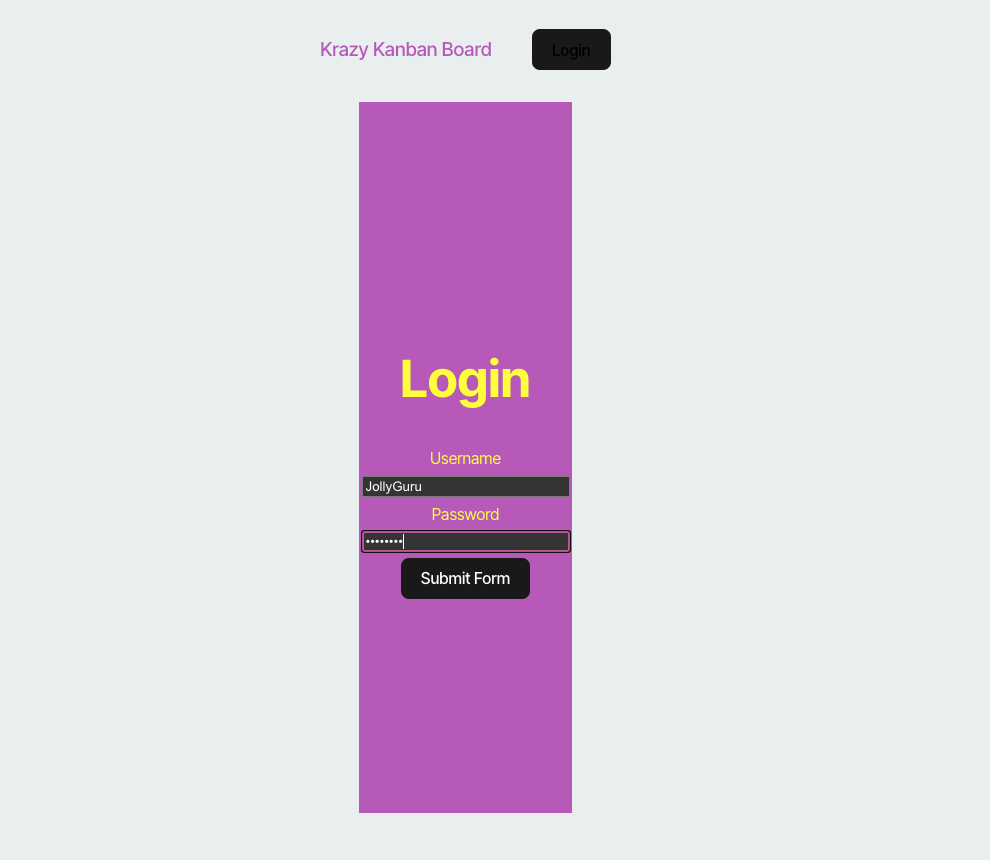
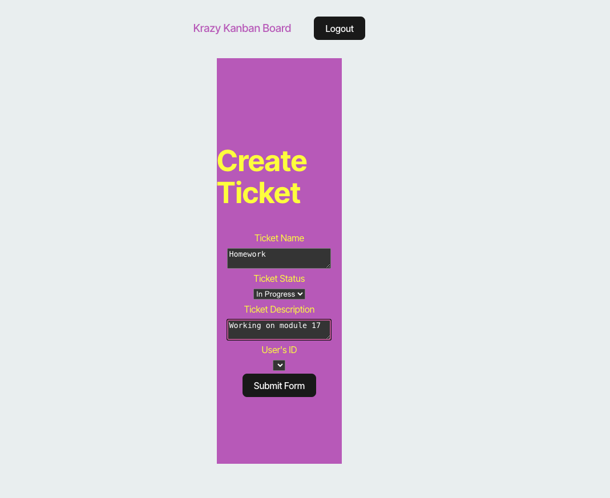

# KanbanKrazy
   ## Description:
   This project allows a user to login using JWT authentication. The user can then create multiple tickets that are listed as "To do" or "Done." The server verifies if the username and password are valid and generates a secret token that is saved to local storage. This token is deleted when the user logs out. 
   ## Table of Contents:
   * [Installation](#installation)
   * [Usage](#usage)
   * [License](#license)
   * [Contributing](#contributing)
   * [Tests](#tests)
   * [Questions](#questions)
   ## Installation:
   You can clone this repository onto your local computer. Run the command "npm install" to install all modules. Run "npm run build" to compile the TypeScript into JavaScript. Start the application with "npm run start:dev".
   ## Usage:
   Here is the deployed link: 
  https://kanbankrazy.onrender.com

   Screenshots of this app:
  
  
   ## License: 
   
   [Click to read more!](https://opensource.org/licenses/MIT)
   ## Contributing:
   Victoria Mata
   ## Tests:
   N/A
   ## Questions:
   * Github: [Link to profile](https://github.com/victoriamata)
   * Email: victoriamataxo@gmail.com